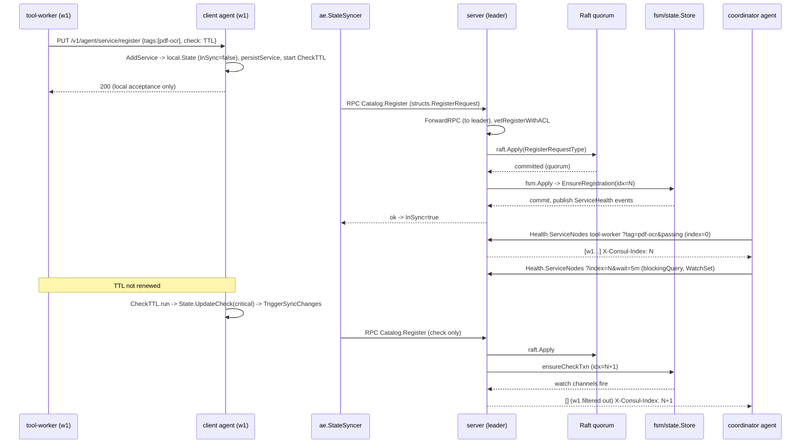

# 03 — Part C: one end-to-end service-discovery lifecycle

Scenario: a worker process `tool-worker` on node `w1` registers with its local **client** agent, tagged with capability `cap=pdf-ocr` (tag `pdf-ocr`, meta `capability=pdf-ocr`), with a TTL check. A coordinator on another node asks its agent for healthy `tool-worker` instances. The worker later fails.

Legend: **[code]** verified in this checkout; **[library]** behaviour inside `hashicorp/raft`, `serf`, `memberlist`, `go-memdb`; **[inference]** my explanation.

---

## Stage 1 — A local client agent starts

**Entry:** `main.go:realMain` → `command.RegisteredCommands` → `command/agent/agent.go:(*cmd).run` → `agent.NewBaseDeps` (`agent/setup.go:101`) → `agent.New` (`agent/agent.go:458`) → `(*Agent).Start` (`agent/agent.go:605`) → `agent.StartSync()` (`command/agent/agent.go`, after `Start` returns).

**Inside `Start` [code]:**
1. `a.baseDeps.AutoConfig.InitialConfiguration(ctx)` (may alter config).
2. `a.State = local.NewState(LocalConfig(c), ...)` — empty local state.
3. `a.sync = ae.NewStateSyncer(a.State, c.AEInterval, ...)`; `consulCfg.ServerUp = a.sync.SyncFull.Trigger` so the first server contact triggers a full sync.
4. `if c.ServerMode` → `consul.NewServer(...)` else `consul.NewClient(...)`; stored as `a.delegate`.
   - `NewClient` (`agent/consul/client.go:105`) sets up `router.Router`, a `pool.ConnPool`, Serf LAN (`client_serf.go:setupSerf`) and starts `lanEventHandler` so server joins/failures update the router.
5. `a.loadServices`, `a.loadChecks` — re-load persisted registrations from `data_dir/services`, `data_dir/checks`.
6. `proxycfg.NewManager`, `xds.NewServer`, `listenAndServeGRPC`, `listenAndServeDNS`, `listenHTTP`.
7. Retry-join (`agent/retry_join.go`) and `JoinLAN` connect gossip.

**State changes:** in-memory `Agent`, `local.State`; Serf snapshot file; nothing in the catalog yet (the leader will add the node when gossip announces it — Stage 7's `HandleAliveMember`).

**Owner of next action:** the agent's HTTP listener (waiting for a registration) and, independently, the leader's reconcile loop (node entry).

**Tests:** `agent/agent_test.go`, `command/agent/agent_test.go`, `agent/consul/client_test.go:TestClient_JoinLAN`-style tests (see file), `agent/testagent.go` (*test helper*: `NewTestAgent` boots a full in-process agent, usually in server+bootstrap mode).

**Failure semantics:** if no servers are reachable, the agent still starts, serves `/v1/agent/*`, runs checks, and retries joins; RPCs return `structs.ErrNoServers` (`client.go:RPC`).

---

## Stage 2 — The worker registers a service, check, and capability metadata

**Entry:** `PUT /v1/agent/service/register` → `agent/http_register.go:59` → `(*HTTPHandlers).AgentRegisterService` (`agent/agent_endpoint.go:1202`).

**Path [code]:**
- Decode `api.AgentServiceRegistration` → `structs.NodeService` (`Service`, `ID`, `Tags`, `Meta`, `Port`, `Kind`, optional `Connect`/`Proxy`, optional `AI`).
- `s.agent.vetServiceRegisterWithAuthorizer(authz, ns)` (`agent/acl.go:45`) — requires `service:write` on the service name when ACLs are enabled.
- `s.agent.AddService(addReq)` → `addServiceLocked` → `addServiceInternal` (`agent/agent.go:2389/2403/2483`): validates, `persistService` (file under `data_dir/services/<sha256>`), `a.State.AddServiceWithChecks(...)` (`agent/local/state.go:306`), then creates check runners via `AddCheck` (`agent/agent.go:2918`).
- For a TTL check, `checks.CheckTTL` (`agent/checks/check.go:238`) is started; its timer expiring calls `Notify.UpdateCheck(id, HealthCritical, "TTL expired…")` (`check.go:282-298`). `Notify` is `local.State` (implements `checks.CheckNotifier`).

**Local state after this [code]:** `local.State.services[id] = &ServiceState{Service, Token, InSync: false}`; `checks[cid] = &CheckState{Check{Status: critical initially unless configured}, InSync: false}`; `TriggerSyncChanges()` fires the `syncChangesNotifEvent`.

**Owner of next action:** `ae.StateSyncer` goroutine.

**Tests:** `agent/agent_endpoint_test.go:TestAgent_RegisterService`, `TestAgent_RegisterService_ACLDeny`, `TestAgent_RegisterCheck`, `TestAgent_PassCheck`, `TestAgent_UpdateCheck`; `agent/local/state_test.go:TestAgentAntiEntropy_Services_WithChecks`.

**Guaranteed vs best-effort:** the HTTP 200 guarantees the *local agent* accepted and persisted the definition. It does **not** guarantee catalog visibility.

---

## Stage 3 — Registration reaches the server path

**Entry:** `ae.StateSyncer.Run` (`agent/ae/ae.go:157`) → `runFSM` → `nextFSMState` (`ae.go:178`).

**State machine [code]:** `fullSyncState` → `State.SyncFull()` → on success `partialSyncState`, on error `retryFullSyncState` (waits `retryFailInterval` or a `SyncFull.Trigger`). In `partialSyncState`, `syncChangesNotifEvent` → `State.SyncChanges()`; `syncFullTimerEvent` (every `ae_interval`, default `1m`, staggered by cluster size via `scaleFactor`) → full sync.

- `SyncFull` (`local/state.go:1227`) → `updateSyncState` (`:1026`): RPC `Catalog.NodeServices` for this node, compares with local, marks `InSync` flags, then `SyncChanges`.
- `SyncChanges` (`:1245`) iterates services/checks: deleted → `deleteService/deleteCheck` (RPC `Catalog.Deregister`); not in sync → `syncService` (`:1434`) which builds `structs.RegisterRequest{Datacenter, ID, Node, Address, TaggedAddresses, NodeMeta, Service, Checks (service checks not yet in sync), WriteRequest{Token}, SkipNodeUpdate: l.nodeInfoInSync}` and calls `l.Delegate.RPC(ctx, "Catalog.Register", &req, &out)`.
- On success `InSync = true` for service and bundled checks. On `acl.IsErrPermissionDenied` / `IsErrNotFound`, it also sets `InSync = true` and logs a warning (so a bad token does not spin the syncer) — **[code]** `state.go` around the `syncService` error switch.

**Transport [code]:** `Agent.RPC` → `delegate.RPC`. For a client: `consul.Client.RPC` (`client.go:283`) → `router.FindLANRoute()` → `connPool.RPC(dc, server.ShortName, server.Addr, method, args, reply)` (msgpack net/rpc over TLS/yamux). On error: `manager.NotifyFailedServer(server)`, `canRetry(...)`, jittered wait via `getWaitTime(RPCHoldTimeout, retryCount)`, retry with another server until `RPCHoldTimeout`.

**Tests:** `agent/ae/ae_test.go:TestAE_FSM`, `TestAE_Run_SyncFullBeforeChanges`; `agent/local/state_test.go:TestAgentAntiEntropy_Services`, `TestState_SyncChanges_DuplicateAddServiceOnlySyncsOnce`, `TestAgentAntiEntropy_Services_ACLDeny`; `agent/consul/client_test.go:TestClient_RPC*`.

**Failure semantics:** the syncer is idempotent (registration is upsert); duplicates are harmless; if servers are down, `InSync` stays false and the next trigger/timer retries; a full sync repairs any drift (e.g. someone deregistered the service via the catalog API — the agent re-asserts it).

---

## Stage 4 — Catalog change is committed and replicated

**Entry (server):** `Catalog.Register` (`agent/consul/catalog_endpoint.go:109`), registered as an RPC endpoint by `agent/consul/server_register.go:init` → `setupRPC` → `rpcServer.Register`.

**Path [code]:**
1. Reject requests carrying `PeerName`.
2. `c.srv.ForwardRPC("Catalog.Register", args, reply)` (`rpc.go:672`) → `forwardRPC` → `forwardRequestToOtherDatacenter` (if `args.Datacenter` differs) or `forwardRequestToLeader` (`rpc.go:788`): if this server is not leader, `getLeader` and forward over the pool; if no leader is known, retry with jitter until `RPCHoldTimeout` then `structs.ErrNoLeader`.
3. On the leader: `ResolveTokenAndDefaultMeta`, `nodePreApply`, `servicePreApply` (validation incl. the mesh:write requirement for escape-hatch keys — see CHANGELOG 2.0.4), `checkPreApply`, look up existing node services via `state.NodeServices`, then `vetRegisterWithACL(authz, args, ns)` (`:325`) — requires `node:write` on the node and `service:write` on the service.
4. `c.srv.raftApply(structs.RegisterRequestType, args)` (`rpc.go:955`) → `raftApplyMsgpack` → `raftApplyWithEncoder` → `raftApplyEncoded` (`:991`): `s.raft.Apply(buf, enqueueLimit)`; `future.Error()` blocks until the entry is committed by a quorum **and** applied to the leader's FSM **[library]**; an `error` returned from the FSM is surfaced as the RPC error.
5. **FSM:** `fsm.FSM.Apply` (`agent/consul/fsm/fsm.go:169`) reads `msgType := buf[0]`, dispatches through the table filled by `commands_ce.go:init` → `applyRegister` → decode → `c.state.EnsureRegistration(index, &req)`; metric `fsm.register`.
6. **State store:** `EnsureRegistration` (`state/catalog.go:138`) → `tx := s.db.WriteTxn(idx)` → `ensureRegistrationTxn` (`:183`): `ensureNodeTxn` (unless `SkipNodeUpdate` and node exists), `ensureServiceTxn` only if `!IsSame` (avoids index churn), `ensureCheckTxn` for each check → `tx.Commit()`. `txn.Commit` (`state/memdb.go:153`) runs `prePublish` to turn memdb `Changes` into `stream.Event`s (`state/catalog_events.go:ServiceHealthEventsFromChanges`) and hands them to `EventPublisher.Publish`. Table indexes (`indexUpdateMaxTxn`) for `nodes`/`services`/`checks` advance to `idx`.

**Durable state:** Raft log entry on every voter (raft-wal by default for fresh data dirs; BoltDB if `raft.db` exists — `server.go:setupRaft`), FSM copy on every server after they apply it, snapshots periodically. `structs.RaftIndex{CreateIndex, ModifyIndex}` is stamped on the rows.

**Owner of next action:** any server answering reads; the event publisher for streaming subscribers.

**Tests:** `agent/consul/catalog_endpoint_test.go:TestCatalog_Register`, `TestCatalog_Register_ForwardLeader`, `TestCatalog_Register_ACLDeny`; `agent/consul/fsm/commands_ce_test.go:TestFSM_RegisterNode_Service`; `agent/consul/state/catalog_test.go:TestStateStore_EnsureRegistration`, `TestStateStore_EnsureCheck`; `agent/consul/state/catalog_events_test.go:TestServiceHealthEventsFromChanges`.

**Failure semantics:** if the leader loses leadership mid-apply, `future.Error()` returns a Raft error (`ErrLeadershipLost`/`ErrNotLeader` **[library]**) and the agent's syncer will retry — the write may or may not have committed, which is safe only because registration is idempotent. Followers apply the same entry later; a `stale` read on a follower can miss it for a replication round trip.

---

## Stage 5 — A consumer queries healthy instances (HTTP path)

**Entry:** `GET /v1/health/service/tool-worker?tag=pdf-ocr&passing=true` → `agent/http_register.go:96` → `HealthServiceNodes` → `healthServiceNodes` (`agent/health_endpoint.go:178`).

**Path [code]:**
1. `s.parse(resp, req, &args.Datacenter, &args.QueryOptions)` (`agent/http.go:1200`): token, DC, `parseConsistency` (`?stale` → `AllowStale`, `?consistent` → `RequireConsistent`; error if both), `parseWait` (`?index`, `?wait` → `MinQueryIndex`, `MaxQueryTime`), `parseCacheControl` (`Cache-Control: max-age=…, stale-if-error=…` → `UseCache`, `MaxAge`, `StaleIfError`). `?tag` → `ServiceTags`, `TagFilter=true`; `?passing` → `HealthFilterType = HealthFilterIncludeOnlyPassing`; `?filter` → bexpr string; `?node-meta`.
2. `s.agent.rpcClientHealth.ServiceNodes(ctx, args)` (`agent/rpcclient/health/health.go:33`):
   - streaming path if `useStreaming(req) && (req.UseCache || req.MinQueryIndex > 0) && !req.MergeCentralConfig` (`UseStreamingBackend` defaults to `true`, `agent/config/builder.go:1218`) → `ViewStore.Get` (materialized view; see Stage 6);
   - else `getServiceNodes`: `UseCache` → `Cache.Get(HealthServicesName)` (`agent/cache-types/health_services.go:Fetch` issues `Health.ServiceNodes`); otherwise direct `NetRPC.RPC("Health.ServiceNodes")`.
   - For a plain one-shot request without `Cache-Control` and without `?index`, the path is the direct RPC.
3. **Server:** `Health.ServiceNodes` (`agent/consul/health_endpoint.go:206`): `ForwardRPC` (with `AllowStale` a follower may answer: `canServeReadRequest` = `IsRead && AllowStaleRead && raft.LastContact != 0`); pick `serviceNodesDefault`/`TagFilter`/`Connect`/`Ingress`; `ResolveTokenAndDefaultMeta`; deny early if `authz.ServiceRead(name) != acl.Allow`; build bexpr filter; then `blockingQuery(...)` whose closure calls `state.CheckServiceNodes`/`CheckServiceTagNodes` (`state/catalog.go:2879/3108` → `checkServiceNodesTxn` → `parseCheckServiceNodes`, joining node + service + node-level and service-level checks), optional `MergeCentralConfig`, `nodeMetaFilter`, `filterACL` (`acl_server.go:201` → `aclfilter.Filter.filterCheckServiceNodes`), then `Filter(CheckServiceNodeFilterOptions{FilterType: HealthFilterType})` (`structs.go:2364`) and bexpr filtering.
4. `blockingquery.Query` (`agent/blockingquery/blockingquery.go:117`) with `MinQueryIndex == 0`: if `RequireConsistent` → `fsmServer.ConsistentRead()` (`raft.VerifyLeader` + readiness); run the query once; `SetQueryMeta` fills `Index`, `LastContact`, `KnownLeader`, `ResultsFilteredByACLs`.
5. Back in HTTP: `setMeta` writes `X-Consul-Index`, `X-Consul-KnownLeader`, `X-Consul-LastContact`, `X-Consul-Effective-Consistency`, `X-Consul-Query-Backend`, `X-Cache`. Body: `[]structs.CheckServiceNode{Node, Service, Checks}`.

**Read-consistency choice, explicitly:**

| Query | Who answers | Guarantee |
|---|---|---|
| default (no flag) | leader (followers forward) | Reflects all writes the leader has applied; **no** leadership verification, so a deposed leader could answer briefly **[inference from code]** |
| `?stale` | any server | May lag; `X-Consul-LastContact` tells you how long since that server heard from the leader |
| `?consistent` | leader, after `raft.VerifyLeader` | Linearizable at extra round-trip cost; fails with `ErrNotReadyForConsistentReads` right after election until a barrier is applied |
| `Cache-Control: max-age` | local agent cache | Bounded staleness chosen by the caller; `X-Cache: HIT/MISS` |

**Tests:** `agent/health_endpoint_test.go:TestHealthServiceNodes`, `TestHealthServiceNodes_PassingFilter`, `TestHealthServiceNodes_Filter`; `agent/consul/health_endpoint_test.go:TestHealth_ServiceNodes`, `TestHealth_ServiceNodes_MultipleServiceTags`, `TestHealth_ServiceNodes_FilterACL`; `agent/consul/catalog_endpoint_test.go:TestCatalog_ListNodes_StaleRead`, `TestCatalog_ListNodes_ConsistentRead(_Fail)`.

---

## Stage 6 — The consumer blocks / watches and learns of a change

**Blocking query [code]:** the consumer repeats the GET with `?index=<X-Consul-Index>&wait=5m`. Server side `blockingquery.Query` now loops: `ConsistentRead` if required; `ws := memdb.NewWatchSet(); ws.Add(store.AbandonCh())`; run the query, which adds table/row watch channels to `ws`; if `responseMeta.Index > minQueryIndex` return; else `ws.WatchCtx(ctx)` blocks until a watched channel fires or the timeout (`RPCQueryTimeout(MaxQueryTime)`; `QueryOptions.BlockingTimeout` adds jitter of `MaxQueryTime/JitterFraction`, capped by server `MaxQueryTime`, default `DefaultQueryTime`). On timeout the same data is returned with the same index (client must treat "same index" as no change). `ErrNotFound`/`ErrNotChanged` are sentinels that keep the loop blocking without returning an empty result at index 0.

**Watch loop:** `api/watch.Plan.Run` (`api/watch/plan.go:32`) is exactly this loop with a handler; `consul watch` CLI wraps it.

**Streaming [code]:** for `?index` or cached requests the agent's `health.Client` uses `submatview.Store.Get` → `RPCMaterializer.Run` → `subscribeOnce` calls the internal gRPC `Subscribe` (`agent/grpc-internal/services/subscribe/subscribe.go:45`, backend `agent/consul/subscribe_backend.go`) with topic `ServiceHealth`, subject = service name; the server sends a snapshot (`state.ServiceHealthSnapshot`) followed by events published at `txn.Commit`. The view (`agent/rpcclient/health/view.go`) applies events and the store answers local blocking reads by index. `X-Consul-Query-Backend: streaming` reveals this.

**Owner of next action:** whoever changes the catalog (Stage 7).

**Tests:** `agent/blockingquery/blockingquery_test.go:TestServer_blockingQuery`; `agent/consul/rpc_test.go:TestServer_blockingQuery`; `agent/health_endpoint_test.go:TestHealthServiceNodes_Blocking`, `_Blocking_withFilter`; `agent/consul/stream/event_publisher_test.go:TestEventPublisher_SubscribeWithIndex0`; `agent/submatview/store_test.go:TestStore_Get/TestStore_Notify`; `agent/grpc-internal/services/subscribe/subscribe_test.go:TestServer_Subscribe_IntegrationWithBackend`.

**Failure semantics:** spurious wake-ups are expected (index moved for an unrelated row in the same table) — callers must diff. Streaming subscriptions are reset (`resetErr`) on ACL changes or server change; the materializer resubscribes with backoff (`isNonTemporaryOrConsecutiveFailure`).

---

## Stage 7 — The health check fails, or the worker's machine disappears

**Case A: TTL missed [code].** `CheckTTL.run` timer fires → `local.State.UpdateCheck(cid, critical, "TTL expired…")` (`local/state.go:670`): if only `Output` changed and `CheckUpdateInterval` (default `5m`) is set, the update is deferred with `time.AfterFunc`; a **status** change sets `InSync=false` and `TriggerSyncChanges()` immediately → `syncCheck` (`:1517`) → `Catalog.Register` with only the check → Stage 4 again → `ensureCheckTxn` updates the `checks` row → index bump → blocking queries wake; the instance now fails `HealthFilterExcludeCritical`/`IncludeOnlyPassing`.

**Case B: the worker process dies but the agent lives.** Same as A once the check (TTL/HTTP/TCP) observes it; nothing in gossip changes.

**Case C: the whole machine (agent) dies [code].** memberlist probes fail → Serf marks the member `failed` → every agent gets `serf.EventMemberFailed`. On servers, `lanEventHandler` → `lanNodeFailed` (only acts if the member is a server: removes it from `serverLookup`/`router`) and `localMemberEvent`, which **only on the leader** pushes the member into `s.reconcileCh`. `leaderLoop` reads `reconcileCh` → `reconcileMember` (`leader.go:1037`): `serf.StatusFailed` → `registrator.HandleFailedMember` (`leader_registrator_v1.go:158`): reads the node's checks from the FSM; if `serfHealth` is not already critical, `RaftApplyFunc(structs.RegisterRequestType, &RegisterRequest{Node, Check: {CheckID: SerfCheckID, Name: SerfCheckName, Status: critical, Output: SerfCheckFailedOutput}})`. Periodically `reconcile()` (`server_ce.go:151`, every `ReconcileInterval`) re-walks all members and `reconcileReaped` handles nodes that gossip has forgotten. On `serf.EventMemberReap`/`Left`, `handleDeregisterMember` issues `DeregisterRequestType` for the whole node.

**On clients**, `client_serf.go:nodeFail` only removes *servers* from the router; client agents do nothing for other clients.

**Tests:** `agent/checks/check_test.go:TestCheckTTL`; `agent/local/state_test.go:TestAgentAntiEntropy_Checks`, `TestAgentAntiEntropy_Check_DeferSync`; `agent/consul/leader_registrator_v1_test.go:TestLeader_FailedMember`, `TestLeader_ReapMember`, `TestLeader_Reconcile`; `agent/consul/server_test.go:TestServer_LANReap`.

---

## Stage 8 — What each state layer shows afterwards, and what the consumer sees

| Layer | Case A (check fails) | Case C (agent dies) |
|---|---|---|
| Local agent state on `w1` | check critical, `InSync=false` until synced | gone with the process (files remain) |
| Gossip | unchanged | member `failed` → later `reaped` (memberlist timeouts **[library]**) |
| Catalog | service check row critical at index N+1 | `serfHealth` node check critical at index N+1; later node deregistered |
| Consumer's blocking query | wakes with index N+1; `?passing` result excludes `w1` | same; node-level critical check excludes all services on `w1` |
| Consumer with `?stale` on a lagging follower | may still show passing for a replication round-trip | same |
| Agent cache / streaming view | event applied, `X-Consul-Index` advances | same |
| Envoy upstream | `proxycfg` receives health update → coalesced snapshot → xDS EDS update; Envoy stops routing | same |

**Do not conflate:** a `passing` service check on a node whose `serfHealth` is critical still yields an *unhealthy* `CheckServiceNode` (node checks are included in `Checks` and `Filter` considers all). Conversely, a node alive in gossip can host critical services. And membership never reflects services at all.

---

## Stage 9 — Servers unavailable, leader change, partition, staleness

- **No leader (quorum lost)**: `Catalog.Register` → `forwardRequestToLeader` retries until `RPCHoldTimeout` then `ErrNoLeader`; agents' `InSync` stays false and the syncer retries later. Non-stale reads fail the same way; `?stale` reads succeed on any server with `X-Consul-KnownLeader: false`. Tests: `TestRPC_NoLeader_Fail`, `TestRPC_NoLeader_Fail_on_stale_read`, `TestRPC_NoLeader_Retry`.
- **Leader changes**: `monitorLeadership` sees `raftNotifyCh`; the new leader runs `leaderLoop`: `raft.Barrier` (so its FSM is caught up), `establishLeadership`, `reconcile()`; `readyForConsistentReads` is set only after the barrier, so `?consistent` reads briefly return `ErrNotReadyForConsistentReads`. In-flight `raftApply` on the old leader returns an error; callers retry (idempotent registration).
- **Client agent partitioned from servers**: local API keeps working; the syncer marks nothing as failed locally; the server side marks the node's `serfHealth` critical, so consumers stop routing to it even though its own checks may be passing. When the partition heals, Serf rejoin → `HandleAliveMember` flips `serfHealth` back to passing, and a full anti-entropy sync re-asserts services.
- **Stale information**: every answer carries `X-Consul-Index` and `X-Consul-LastContact`; consumers that need bounded staleness must check `LastContact` (or use `max_stale` for DNS, `MaxStaleDuration` in `QueryOptions`).
- **Duplicate / reordered messages**: registration is an upsert keyed by node+service ID; check updates are last-writer-wins at Raft order; anti-entropy full sync is the repair mechanism for any lost update.

---

## Diagrams



```mermaid
sequenceDiagram
    participant CA as client agent (w1)
    participant F as follower server
    participant OL as old leader (partitioned)
    participant NL as new leader
    participant C as coordinator agent

    Note over OL,NL: partition splits OL from quorum; election -> NL
    CA->>F: Catalog.Register (via router)
    F->>F: forwardRequestToLeader: getLeader -> none yet
    F->>F: retry with jitter until RPCHoldTimeout (7s)
    NL-->>F: leadership known
    F->>NL: forward Catalog.Register
    NL->>NL: raft.Apply (barrier already applied in leaderLoop)
    C->>F: Health.ServiceNodes ?stale
    F-->>C: answer from follower FSM, X-Consul-LastContact=elapsed, KnownLeader=true/false
    C->>F: Health.ServiceNodes ?consistent
    F->>NL: forward
    NL->>NL: raft.VerifyLeader + readyForConsistentReads?
    NL-->>C: ok, or ErrNotReadyForConsistentReads right after election
    Note over OL: old leader may still answer a *default* read from its FSM until it steps down (no VerifyLeader on default reads)
```

## What a caller may safely assume vs must tolerate

| May safely assume | Must tolerate |
|---|---|
| A successful `Catalog.Register` RPC (or catalog HTTP write) is committed to a quorum and applied on the leader before the reply | A successful `PUT /v1/agent/service/register` is only locally accepted; catalog visibility is asynchronous (typically sub-second, but unbounded when servers are unreachable) |
| `X-Consul-Index` is monotonic for a given leader and table; a strictly greater index means something changed | Index can move without the caller's result set changing (spurious wake-ups); on leader change the index continues from the log, never goes backwards, but `?stale` on a lagging follower can return a *lower* index than a previous answer from another server |
| `?consistent` answers are linearizable at the moment of `VerifyLeader` | `ErrNotReadyForConsistentReads`/`ErrNoLeader` during elections; extra latency |
| Default reads reflect all writes acknowledged before the read reached the leader | A deposed leader may answer a default read briefly with pre-partition state **[inference]** |
| `?passing` excludes any instance with a critical check, including node-level `serfHealth` | Health is as fresh as the check interval/TTL plus sync delay; an instance can be dead for up to (TTL + sync) before the catalog knows |
| An agent that stops gossiping will have its node's `serfHealth` set critical by the leader | Failure detection latency is memberlist probe/suspicion time **[library]**; false positives on slow networks; automatic recovery on rejoin |
| Registrations survive agent restart (persisted files) and catalog drift (anti-entropy re-asserts them) | External deregistration of an agent-owned service will be undone by anti-entropy; a wrong ACL token makes the agent silently stop syncing that service (`InSync=true` after permission denied) |
| DNS answers are available even with no leader (stale by default) | DNS answers can be up to `max_stale` old and are shuffled/truncated |
| Streaming/cache-backed answers carry the same index semantics | Backend selection differs per request shape (`X-Consul-Query-Backend`); caching adds bounded staleness the caller chose |
