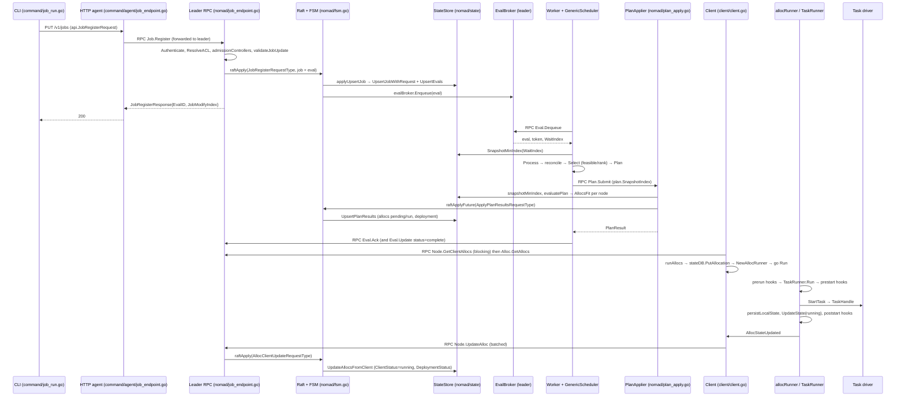
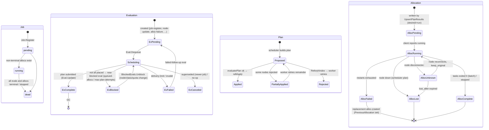

# 03 — Part C: One job, from declaration to execution to recovery

Scenario: *A user submits a `service` job with one task group (`count = 3`), CPU/memory resources, a service with a health check, and an `update` block. Later one client that runs an instance fails. Nomad converges back to three healthy instances.*

Each stage: paths and symbols, inputs/outputs, durable vs transient state, who owns the next action, consistency/retry/timeout semantics, the invariant preserved, tests to read, and checkout-specific caveats. Tags: **[source]** observed, **[repo-doc]** from `contributing/`, **[inference]** my interpretation.

---

## Stage 1 — User submits the job via CLI

- **Where [source]:** `command/job_run.go` `(*JobRunCommand).Run` → uses the embedded `JobGetter` to parse HCL (HCL2 via `jobspec2`, [repo-doc `contributing/checklist-jobspec.md`]) into an `api.Job` → `client.Jobs().RegisterOpts(job, opts, nil)` (`command/job_run.go` line ~291) → `api/jobs.go` `(*Jobs).RegisterOpts` → `PUT /v1/jobs` with a `JobRegisterRequest` body.
- **Inputs:** HCL file, `-check-index`, `-policy-override`, `-eval-priority`, namespace/region/token from env or flags.
- **Outputs:** `api.JobRegisterResponse{EvalID, EvalCreateIndex, JobModifyIndex, Warnings}`. The CLI then follows the eval with `nomad eval status`-style monitoring (same command file).
- **Durable vs transient:** nothing durable yet; the CLI holds the job in memory.
- **Next owner:** the HTTP agent.
- **Semantics:** plain HTTP request; if the connection drops the CLI does not know whether the write happened. Re-running is safe because `Job.Register` is an upsert; the optional `-check-index` (`EnforceIndex`) makes it a compare-and-swap.
- **Invariant:** the CLI never talks to `nomad/structs`; only `api` types cross this boundary (enforced by `make check`).
- **Tests:** `command/job_run_test.go`; `api/jobs_test.go` `TestJobs_Register`, `TestJobs_EnforceRegister` (needs a built binary).
- **Caveat:** in `-dev` mode the HTTP agent, server, and client are one process, which hides the network hop.

## Stage 2 — HTTP API → server RPC boundary

- **Where [source]:** `command/agent/http.go` `registerHandlers` maps `/v1/jobs` to `(*HTTPServer).JobsRequest`; PUT/POST goes to `jobUpdate` (`command/agent/job_endpoint.go` line ~555) which calls `ApiJobToStructJob`, builds `structs.JobRegisterRequest`, fills `WriteRequest` via `parseWriteRequest` (region, namespace, `AuthToken` from `parseToken`), then `s.agent.RPC("Job.Register", &regReq, &out)` (line ~609). `(*Agent).RPC` (`command/agent/agent.go`) calls the in-process server if this agent is a server, otherwise the client's `(*Client).RPC` which picks a known server.
- On the server: `nomad/rpc.go` `rpcHandler.listen` → `handleConn` → `handleMultiplexV2`/`handleNomadConn` → net/rpc dispatch to the `Job` endpoint struct registered in `(*Server).setupRpcServer`.
- **Inputs/Outputs:** `structs.JobRegisterRequest` → `structs.JobRegisterResponse`.
- **Durable vs transient:** transient.
- **Next owner:** the `Job` RPC endpoint on whichever server received the connection.
- **Semantics:** `Job.Register` begins with `j.srv.forward("Job.Register", ...)` (`nomad/rpc.go` `rpcHandler.forward`): if the region differs → `forwardRegion`; if this server is not the leader → `forwardLeader` via `getLeaderForRPC`. Forwarding returns `structs.ErrNoLeader` if none is known; the client side retries with backoff (`client/rpc.go` `rpcRetryWatcher`). Write requests cannot be stale.
- **Invariant:** *every* write is executed on the leader; followers only forward.
- **Tests:** `command/agent/job_endpoint_test.go` `TestHTTP_JobsRegister`, `TestHTTP_JobsRegister_Defaulting`; `nomad/rpc_test.go` `TestRPC_forwardLeader`, `TestRPC_forwardRegion`.

## Stage 3 — Validation and authorization

- **Where [source]:** `nomad/job_endpoint.go` `(*Job).Register` (line 93): `Authenticate` (before forward; result used after), `forward`, `MeasureRPCRate`, `ResolveACL`, then `doRegister`:
  - `registrationsAreAllowed` (cluster-wide toggle for non-management tokens),
  - namespace consistency check between request and job,
  - `admissionControllers(args.Job)` (`nomad/job_endpoint_hooks.go` line 178) = `admissionMutators` (canonicalize, implied constraints, node-pool/Consul/Vault/scheduler hooks, several `*_ce.go` CE variants) then `admissionValidators` (`jobValidate.Validate` → `structs.Job.Validate` and `Warnings`),
  - ACL: `aclObj.AllowNsOpAnyOf(namespace, submit-job/...)` plus extra checks for CSI plugins and `PolicyOverride` (Sentinel is enterprise; `enforceSubmitJob` is a CE stub here),
  - `EnforceIndex` → `existingJob.EnforceIndex(args.JobModifyIndex)`,
  - `validateJobUpdate(existingJob, args.Job)` (type/periodic transitions),
  - `propagateScalingPolicyIDs`, Consul config entries (`*_ce.go`).
- **Inputs/Outputs:** the request; a canonicalized `structs.Job` and a warnings string; or an error (`ErrPermissionDenied`, validation error).
- **Durable vs transient:** transient; reads a state *snapshot* (`snap`) for the existing job.
- **Next owner:** same handler continues to Stage 4.
- **Semantics:** synchronous; any error aborts before Raft. [inference] Because validation reads a snapshot and the write happens later, two concurrent registers of the same job can both pass validation; the later Raft apply wins (last-writer) unless `EnforceIndex` was used.
- **Invariant:** no invalid or unauthorized job reaches the Raft log.
- **Tests:** `nomad/job_endpoint_test.go` `TestJobEndpoint_Register_ACL`, `TestJobEndpoint_Register_InvalidNamespace`, `TestJobEndpoint_Register_NonOverlapping`; `nomad/job_endpoint_hooks_test.go`; `nomad/auth/auth_test.go` `TestAuthenticateDefault`.
- **Caveat:** ACL enforcement depends on `acl.enabled` in server config; with ACLs off `ResolveACL` returns a permissive ACL. Sentinel policy enforcement is enterprise-only and stubbed.

## Stage 4 — Desired state written through Raft → FSM → state store

- **Where [source]:** `nomad/job_endpoint.go` lines ~295–370: sets `SubmitTime`; if not periodic/parameterized, builds `args.Eval = &structs.Evaluation{ID: uuid, Type: job.Type, TriggeredBy: EvalTriggerJobRegister, Status: EvalStatusPending, Priority: ...}`; if the spec did not change it only writes the eval (`raftApply(EvalUpdateRequestType, ...)`); otherwise `args.Deployment = j.multiregionCreateDeployment(...)` (CE: nil) and `j.srv.raftApply(structs.JobRegisterRequestType, args)`.
- `(*Server).raftApply` (`nomad/rpc.go` line 810) → `raftApplyFuture` encodes `(MessageType, msg)` with msgpack, calls `raft.Apply`, waits for the future; returns the FSM response and the committed index.
- On *every* server the Raft library invokes `nomadFSM.Apply` (`nomad/fsm.go` line 250) → `case JobRegisterRequestType` → `applyUpsertJob` (line 666): decode, `Canonicalize`, optional idempotency-token check (`CheckIdempotencyToken`), `state.UpsertJobWithRequest` (→ `upsertJobImpl`: job table, job version table, job summary, scaling policies, submission), `periodicDispatcher.Add`, then if `req.Eval != nil` it upserts the eval and, on the leader, enqueues it into the broker (the FSM calls `n.evalBroker.Enqueue(eval)` — see `nomad/fsm.go` around line 975; the broker ignores enqueues when disabled on followers).
- **Inputs/Outputs:** `JobRegisterRequest` → committed index; reply gets `JobModifyIndex`, `EvalID`, `EvalCreateIndex`, `Index`.
- **Durable vs transient:** **durable**: job, job version, job summary, evaluation (same Raft entry, same memdb transaction). Transient: the broker's queue entry.
- **Next owner:** the leader's `EvalBroker`.
- **Semantics:** `raftApply` returns only after commit; the response to the user is therefore linearizable with respect to the job write. Determinism rules [repo-doc `architecture-state-store.md`]: FSM code must not generate IDs or timestamps; that is why the eval ID and `SubmitTime` are set in the RPC handler.
- **Invariant:** job and its triggering eval are written atomically; there is never a job update without an eval for non-periodic/non-parameterized jobs.
- **Tests:** `nomad/fsm_test.go` `TestFSM_RegisterJob`; `nomad/state/state_store_test.go` `TestStateStore_UpsertJob_Job`, `TestStateStore_UpdateUpsertJob_JobVersion`, `TestStateStore_UpsertJobWithRequest`; `nomad/job_endpoint_test.go` `TestJobEndpoint_Register` (asserts job + eval exist after the RPC).
- **Caveat:** `Deployment` pre-registration is enterprise multiregion only; in CE the deployment is created later by the scheduler.

## Stage 5 — Evaluation created / enqueued

- **Where [source]:** `nomad/eval_broker.go` `Enqueue` → `processEnqueue`: if `WaitUntil` set → delay heap; if `ShouldEnqueue` (pending) → per-scheduler-type ready queue keyed by priority; dedupes so only one eval per `(namespace, jobID)` is *ready* at a time (`jobEvals`), others are held and released on `Ack`. Blocked evals go to `BlockedEvals.Block` instead (`ShouldBlock`).
- **Inputs/Outputs:** the `Evaluation` record; an in-memory queue entry.
- **Durable vs transient:** eval is durable (Stage 4); the queue is transient and rebuilt on leadership by `(*Server).restoreEvals` (`nomad/leader.go` line 826) which scans all non-terminal evals.
- **Next owner:** any scheduler worker that dequeues it.
- **Semantics:** at-least-once delivery to workers. `Dequeue` hands out a token and starts a nack timer (`EvalNackTimeout`, default 60s [source `nomad/config.go` `DefaultConfig`]); if not acked in time, or explicitly nacked, it is re-enqueued with `nackReenqueueDelay` (1s then 20s by default) up to `EvalDeliveryLimit` (default 3), after which it goes to the failed queue; the leader's `reapFailedEvaluations` marks it failed and creates a `failed-follow-up` eval with a delay (`createFailedFollowup`). Duplicate blocked evals are cancelled by `reapDupBlockedEvaluations`.
- **Invariant:** at most one eval per job is being processed at a time (serialization per job), so two workers never produce competing plans for the same job.
- **Tests:** `nomad/eval_broker_test.go` `TestEvalBroker_Enqueue_Dequeue_Nack_Ack`, `TestEvalBroker_Serialize_DuplicateJobID`, `TestEvalBroker_Nack_Timeout`, `TestEvalBroker_AckAtDeliveryLimit`, `TestEvalBroker_WaitUntil`; `nomad/leader_test.go` `TestLeader_EvalBroker_Reset`, `TestLeader_ReapFailedEval`.

## Stage 6 — The evaluation reaches a scheduler worker

- **Where [source]:** `nomad/worker.go` `(*Worker).run` (line 398): `dequeueEvaluation` → RPC `Eval.Dequeue` (`nomad/eval_endpoint.go` line 120: `AuthenticateServerOnly`, forward to leader, reject on `SchedulerVersion` mismatch, `evalBroker.Dequeue(schedulers, timeout)`, computes `WaitIndex` = the index the worker must have applied before scheduling, via `getWaitIndex`) → `snapshotMinIndex(waitIndex, raftSyncLimit)` (blocks until this server's state store has applied at least that index; on timeout it nacks) → `invokeScheduler(snap, eval, token)` → `scheduler.NewScheduler(eval.Type, ...)` with the worker itself as the `Planner` → `sched.Process(eval)` → `sendAck` or `sendNack`.
- **Inputs/Outputs:** eval + token + wait index → ack/nack.
- **Durable vs transient:** transient (snapshot is a memdb read transaction).
- **Next owner:** the scheduler instance.
- **Semantics:** the worker may live on a follower whose state lags; `snapshotMinIndex` closes that gap so the scheduler never reads a job older than the eval that references it. Workers can be paused (`handlePausableWorkers`) e.g. on the leader depending on scheduler configuration.
- **Invariant:** scheduler state index ≥ eval's `ModifyIndex` (and job's, via `getWaitIndex`).
- **Tests:** `nomad/worker_test.go` `TestWorker_dequeueEvaluation`, `TestWorker_waitForIndex`, `TestWorker_invokeScheduler`, `TestWorker_dequeueEvaluation_SerialJobs`.

## Stage 7 — Scheduler: read, reconcile, filter, score, plan

- **Where [source]:** `scheduler/generic_sched.go`:
  - `Process` (line 104): validates `TriggeredBy`, then `retryMax(limit=5, s.process, progressMade)`; on exhaustion creates a blocked eval (`createBlockedEval(true)`, trigger `max-plan-attempts`) and sets status; otherwise sets status `complete` via `setStatus` → `Planner.UpdateEval`.
  - `process` (line 204): `state.JobByID`; `s.plan = eval.MakePlan(job)`; `LatestDeploymentByJobID`; `feasible.NewEvalContext`; `feasible.NewGenericStack(batch=false, ctx)`; `setJob`; `computeJobAllocs`; create blocked eval if some groups failed; create delayed follow-up evals (`followUpEvals`, for `reschedule` with delay); `planner.SubmitPlan(plan)`; if `RefreshIndex` returned → swap state and retry; if `!result.FullCommit(plan)` → retry.
  - `computeJobAllocs` (line 329): `state.AllocsByJob`; `taintedNodes` (`scheduler/util.go` — down/drained/disconnected nodes); `reconciler.NewAllocReconciler(...)` with `genericAllocUpdateFn` (decides in-place vs destructive update via `tasksUpdated`/`inplaceUpdate`); `Compute()` returns `ReconcileResults`: stops, in-place updates, destructive updates, placements (`PlacementResult`), desired deployment changes, follow-up evals. Stops are appended with `plan.AppendStoppedAlloc`; disconnect/unknown with `AppendUnknownAlloc`.
  - `computePlacements` (line 487): for each placement, `findPreferredNode` (sticky/previous node), `selectNextOption` → `stack.Select(tg, options)`:
    - `feasible.GenericStack.Select` (`scheduler/feasible/stack.go` line 136): source nodes (shuffled `StaticIterator`), feasibility chain (`ConstraintChecker`, `DriverChecker`, `HostVolumeChecker`, `CSIVolumeChecker`, `NetworkChecker`, `DeviceChecker`, `DistinctHostsIterator`, `DistinctPropertyIterator`, wrapped by `FeasibilityWrapper` with computed-class caching in `EvalContext`), then rank chain (`BinPackIterator` → uses `structs.AllocsFit`/`ScoreFitBinPack` or `ScoreFitSpread` per `SchedulerConfiguration`; `JobAntiAffinityIterator`; `NodeReschedulingPenaltyIterator`; `NodeAffinityIterator`; `SpreadIterator`; `ScoreNormalizationIterator`), then `LimitIterator` (stop after a few feasible nodes unless spread) and `MaxScoreIterator`.
    - On success builds `structs.Allocation{ID, Namespace, EvalID, Name, JobID, TaskGroup, Metrics: ctx.Metrics(), NodeID: option.Node.ID, DeploymentID, AllocatedResources, DesiredStatus: run, ClientStatus: pending, PreviousAllocation, RescheduleTracker (via UpdateRescheduleTracker)}`, `handlePreemptions`, `plan.AppendAlloc(alloc, downgradedJob)`.
    - On failure records `failedTGAllocs[tg] = metrics` (this becomes the "placement failure" you see in `nomad job status`).
  - Deployment: for a `service` job with an `update` block, the reconciler creates or advances a `Deployment` (`createDeployment`, `computeDeploymentComplete`, canaries) and limits placements to `MaxParallel`; the deployment goes into the plan (`plan.Deployment`, `plan.DeploymentUpdates`).
- **Inputs/Outputs:** eval + snapshot → `structs.Plan` (per-node allocation lists, stops, preemptions, deployment) + side evals (blocked, delayed reschedule).
- **Durable vs transient:** the plan is transient until Stage 8; blocked/follow-up evals are made durable through `Planner.CreateEval`/`ReblockEval` → `Eval.Create`/`Eval.Reblock` RPCs → Raft.
- **Next owner:** `Worker.SubmitPlan`.
- **Semantics:** pure computation on an immutable snapshot; a panic is recovered and turned into a failed eval (`Process` defer). Placement is *not* globally optimal: `LimitIterator` looks at a bounded number of feasible nodes for service jobs [repo-doc `architecture-eval-lifecycle.md`: "up to 2 Nodes"]. The reconciler's *placement count* obeys `MaxParallel` and canaries, so a `count = 3` job with `max_parallel = 1` may place fewer than 3 in this pass and rely on the deployment watcher to create the next eval.
- **Invariant:** the scheduler never writes state directly; every durable effect goes through the `Planner` interface. The plan's `SnapshotIndex` records exactly what the scheduler saw.
- **Tests:** `scheduler/generic_sched_test.go` `TestServiceSched_JobRegister` (3 allocs placed, eval complete, plan annotations), `TestServiceSched_JobRegister_CreateBlockedEval`, `TestServiceSched_JobModify_Rolling`, `TestServiceSched_JobModify_Canaries`; `scheduler/reconciler/reconcile_cluster_test.go` `TestReconciler_Place_NoExisting`, `TestReconciler_DestructiveMaxParallel`; `scheduler/feasible/stack_test.go` `TestServiceStack_Select_Size`, `TestServiceStack_Select_ConstraintFilter`; `scheduler/feasible/rank_test.go` `TestBinPackIterator_NoExistingAlloc`.
- **Caveat:** bin-pack vs spread and preemption are governed by `SchedulerConfiguration` (`nomad operator scheduler`), stored in state (`getOrCreateSchedulerConfig`). NUMA-aware scheduling has CE stubs (`scheduler/feasible/numa_ce.go`).

## Stage 8 — Plan applied safely under concurrency

- **Where [source]:**
  - `nomad/worker.go` `SubmitPlan` (line 650): sets `plan.EvalToken`, `plan.SnapshotIndex = w.snapshotIndex`, `NormalizeAllocations()` (lean plan when all servers support it), RPC `Plan.Submit`; on `result.RefreshIndex != 0` waits via `snapshotMinIndex(RefreshIndex)` and returns the new `State` so the scheduler retries.
  - `nomad/plan_endpoint.go` `(*Plan).Submit` (line 28): server-only auth, forward to leader, verify the eval token is the outstanding one (`evalBroker.Outstanding`), `planQueue.Enqueue(plan)` → wait on the `PlanFuture`.
  - `nomad/plan_apply.go` `planner.planApply(maxPipelineDepth)` (line 100): single goroutine on the leader. For each pending plan: drain completed Raft indexes from `planIndexCh`, ensure the snapshot index ≥ `max(prevPlanResultIndex, plan.SnapshotIndex)` (`snapshotMinIndex`), `evaluatePlan(pool, snap, plan)` → `evaluatePlanPlacements` → per node `evaluateNodePlan` (line 784): node must exist; `disconnected` nodes accept only `unknown`-status updates; `down` nodes only stops; not-`ready` nodes reject placements; `AllocSubset` short-circuits in-place updates; `ineligible` nodes reject new placements; otherwise `structs.AllocsFit(node, proposed, ...)` with existing non-terminal allocs minus stopped/preempted plus new. Nodes that fail are put in `result.RejectedNodes`; repeated rejections mark nodes ineligible (`IneligibleNodes`). If the plan is fully or partially valid, `applyPlan` builds `ApplyPlanResultsRequest` (allocs, stops as `AllocationDiff`, preemptions, deployment + updates, `EvalID`, timestamps), signs workload identities (`signAllocIdentities` with the `Encrypter`), and issues `raftApplyFuture(ApplyPlanResultsRequestType, ...)`; `asyncPlanWait` reports the committed index back. If nothing could be applied, the result carries `RefreshIndex` so the worker refreshes.
  - FSM: `applyPlanResults` → `state.UpsertPlanResults` (`nomad/state/state_store.go` line 359): denormalizes stopped/preempted allocs, marks ineligible nodes, `upsertDeploymentImpl`, `upsertDeploymentUpdates`, updates the eval's modify index, `upsertAllocsImpl` (which also updates job summaries and deployment counts via `updateDeploymentWithAlloc`), single transaction commit.
- **Inputs/Outputs:** `Plan` → `PlanResult{NodeAllocation, NodeUpdate, RejectedNodes, RefreshIndex, AllocIndex, Deployment...}`; FSM writes allocs.
- **Durable vs transient:** **durable**: allocations (with `DesiredStatus=run`, `ClientStatus=pending`, `NodeID`), stopped allocs (`DesiredStatus=stop`), deployment, eval modify index. Transient: plan queue, in-flight snapshot with optimistic updates.
- **Next owner:** the client whose node ID is on each allocation (pull), and the deployment watcher (for service jobs).
- **Semantics:** *Optimistic concurrency*: workers computed on possibly stale snapshots; the leader re-validates against a snapshot that is guaranteed to include the plan's `SnapshotIndex` and all previously applied plans. Concurrent plans for different jobs targeting the same node are serialized here; the second one is rejected on that node if it no longer fits (`TestPlanEndpoint_ApplyConcurrent`). Partial commits are allowed and the worker retries the remainder (`FullCommit` false → retry). Leader change mid-apply: the Raft apply fails, `pending.respond(nil, err)`, the worker nacks, a new leader restores the eval and some worker redoes it; because the FSM upsert is idempotent by alloc ID and a *new* scheduling pass generates *new* alloc IDs, [inference] a partially committed old plan simply shows up as existing allocations that the next reconcile pass accounts for.
- **Invariant:** for every node, `sum(AllocatedResources of non-terminal allocs) ≤ NodeResources − ReservedResources` at the moment of commit; and no allocation is ever written for a node the leader believes is not ready.
- **Tests:** `nomad/plan_apply_test.go` `TestPlanApply_applyPlan`, `TestPlanApply_EvalPlan_Partial`, `TestPlanApply_EvalPlan_Partial_AllAtOnce`, `TestPlanApply_EvalNodePlan_NodeFull`, `TestPlanApply_EvalNodePlan_NodeNotReady`, `TestPlanApply_EvalNodePlan_NodeDrain`; `nomad/plan_endpoint_test.go` `TestPlanEndpoint_ApplyConcurrent`; `nomad/state/state_store_test.go` `TestStateStore_UpsertPlanResults_AllocationsCreated_Denormalized`, `TestStateStore_UpsertPlanResults_Deployment`; `nomad/worker_test.go` `TestWorker_SubmitPlan_MissingNodeRefresh`.
- **Caveat:** `PlanApplyPipeline` (server config) controls how many plans may be in flight; `plan_apply_ce.go` holds CE stubs for enterprise checks (e.g. quotas). Identity signing requires the keyring to be initialized (`TestPlanApply_KeyringNotReady`).

## Stage 9 — Allocations become visible to the selected client

- **Where [source]:** `client/client.go` `watchAllocations` (line 2482): loop of blocking `Node.GetClientAllocs` (`nomad/node_endpoint.go` line 1344; `AuthenticateClientOnly`; `blockingRPC` on `AllocsByNode` watch set; returns alloc IDs → modify indexes plus `MigrateTokens`), then computes which allocs are new/changed vs `c.allocs`, and fetches full bodies with `Alloc.GetAllocs` (`nomad/alloc_endpoint.go` line 192). First call uses `AllowStale: false`; subsequent calls `AllowStale: true` (followers can serve). Results go on the `updates` channel to `runAllocs`.
- **Inputs/Outputs:** node ID + secret/identity + `MinQueryIndex` → alloc list; full allocations.
- **Durable vs transient:** transient until Stage 10 persists.
- **Next owner:** `runAllocs` on the client.
- **Semantics:** pull-based, long-polling; if the server returns an index ≤ requested (stale follower) the client retries; if a pulled alloc set is missing an expected ID (index skew between the two RPCs), the client sleeps and retries. Timeouts fall back to retry with `retryIntv`. Nothing in this stage can create duplicate allocations: allocation identity is the server-issued ID.
- **Invariant:** the client only ever acts on allocations whose `NodeID` is its own, as served by the server.
- **Tests:** `nomad/node_endpoint_test.go` `TestClientEndpoint_GetClientAllocs`, `TestClientEndpoint_GetClientAllocs_Blocking`, `TestClientEndpoint_GetClientAllocs_PreferTableIndex`, `TestClientEndpoint_GetAllocs_Blocking`; `client/client_test.go` `TestClient_WatchAllocs`.

## Stage 10 — Client persists, reconciles, starts runners, invokes the driver

- **Where [source]:**
  - `client/client.go` `runAllocs` (line 2765): `diffAllocs(existing, update)` → `removeAlloc` (stop + destroy runner), `updateAlloc` (→ `ar.Update`), `addAlloc` (line 2925): `stateDB.PutAllocation(alloc)` **before** creating the runner, `NewAllocRunner(config)` (with `PreviousRunner`, preempted runners, migrate token), `c.allocs[id] = ar`, `go ar.Run()`.
  - `client/allocrunner/alloc_runner.go` `Run` (line 373): `go handleTaskStateUpdates()`, `go handleAllocUpdates()`; if `shouldRun()` → `prerun()` hooks (`alloc_runner_hooks.go`: alloc dir, `network_hook`, `identity_hook`, `consul_hook`, `csi_hook`, `group_service_hook`, `health_hook`, `checks_hook`, ...) → `runTasks()` (one `go task.Run()` per `TaskRunner`, wait on `WaitCh`) → `postrun()`.
  - `client/allocrunner/taskrunner/task_runner.go` `Run` (line 570): `MAIN:` loop: `prestart()` (task dir, logmon, artifacts, templates, identity, secrets, vault, device, volume hooks) → `runDriver()` (`initDriver` → `driverManager.Dispense(task.Driver)`; `driver.StartTask(taskConfig)` → `TaskHandle`; `persistLocalState` so the handle survives restarts; `UpdateState(TaskStateRunning, TaskStarted event)`) → `poststart()` (service registration hook, stats hook) → wait on `handle.WaitCh` or a kill → `handleTaskExitResult` → `restartTracker.SetExitResult` → `exited()` hooks → `shouldRestart()` (per `RestartPolicy` → `restarts.RestartTracker.GetState`) → either `goto MAIN` after delay or fall through → `UpdateState(TaskStateDead)` → `stop()` hooks.
  - Driver: `drivers/rawexec/driver.go` `StartTask` (line 391) launches through `drivers/shared/executor` (a separate supervised process); `drivers/mock/driver.go` `StartTask` (line 454) fakes it (dev builds only); `drivers/docker` talks to the Docker daemon.
  - Status feedback: `TaskRunner.UpdateState` → alloc runner `handleTaskStateUpdates` → computes alloc `ClientStatus` from task states (`clientAlloc`), persists (`PutTaskState`, `PutAllocation`) → `stateUpdater.AllocStateUpdated(alloc)` → `client.AllocStateUpdated` queues it → `allocSync` (line 2399) batches every 200ms into `Node.UpdateAlloc`.
- **Inputs/Outputs:** allocation → running processes, task events, task states; local BoltDB rows.
- **Durable vs transient (client):** durable locally: allocation, task states, task local state incl. driver handle, deployment status, network status, identities. Transient: runner goroutines, hook objects, driver handles in memory.
- **Next owner:** the driver (process lifetime), the task runner (exit handling), the server (status persistence).
- **Semantics:** `addAlloc` writes to BoltDB before starting the runner so a crash between the two is recoverable (`restoreState` → `NewAllocRunner` → `ar.Restore()` → `TaskRunner.Restore` → `restoreHandle` → `driver.RecoverTask`; if recovery fails the task is marked failed and the restart policy applies). Task start errors can be *recoverable* (`structs.Recoverable`) and are retried by the restart tracker (`TestTaskRunner_Run_RecoverableStartError`). Prerun hook failure fails the whole alloc (`TestClient_AllocPrerunErrorDuringRestore`).
- **Invariant:** no task runner exists without its allocation already persisted locally; and a task's driver handle is persisted before the task is reported running, so a client restart can re-attach rather than double-start.
- **Tests:** `client/client_test.go` `TestClient_SaveRestoreState`, `TestClient_AddAllocError`; `client/allocrunner/alloc_runner_test.go` `TestAllocRunner_AllocState_Initialized`, `TestAllocRunner_Update_Semantics`, `TestAllocRunner_Restore_LifecycleHooks`; `client/allocrunner/taskrunner/task_runner_linux_test.go` `TestTaskRunner_Restore_Running`, `TestTaskRunner_Stop_ExitCode`, `TestTaskRunner_RecoverFromDriverExiting`; `client/state/db_test.go` `TestStateDB_Allocations`.
- **Caveat:** the exact hook set is OS-dependent (`network_manager_linux.go` vs `network_manager_nonlinux.go`; cgroups; `landlock` fingerprint), and the driver set depends on build tags (`mock_driver` excluded with `release`). Most task-runner tests are `//go:build linux`.

## Stage 11 — Health, exit, failure; status travels back

- **Where [source]:**
  - Health (deployment): `client/allocrunner/health_hook.go` `allocHealthWatcherHook.Prerun/Update` → `getHealthParams` (`MinHealthyTime`, `HealthyDeadline`, `useChecks` from the group's `Update` block; only when `alloc.DeploymentID != ""`) → `allochealth.NewTracker(...).Start()` → `watchTaskEvents` + `watchConsulEvents`/`watchNomadEvents` → `HealthyCh` → `allocHealthSetter.SetHealth(healthy, isDeploy, events)` → `persistDeploymentStatus` + `AllocStateUpdated`.
  - Server side: `Node.UpdateAlloc` (`nomad/node_endpoint.go` line 1512) → for each alloc, if terminal-failed and `RescheduleEligible(policy, now)` create an eval with `EvalTriggerRetryFailedAlloc` (`alloc-failure`), otherwise if `ShouldReschedule` is false, nothing; batch via `batchUpdate` → `raftApply(AllocClientUpdateRequestType)` → FSM `applyAllocClientUpdate` → `state.UpdateAllocsFromClient` → `nestedUpdateAllocFromClient` (copies alloc, merges `ClientStatus`, `TaskStates`, `DeploymentStatus`, `NetworkStatus`; updates job summary; `updateDeploymentWithAlloc` bumps `HealthyAllocs`/`UnhealthyAllocs` on the `DeploymentState`; also emits `EvalUpdate` for included evals).
  - Deployment watcher (leader): `nomad/deploymentwatcher/deployment_watcher.go` `watch` (line 416) blocks on alloc changes (`getAllocsCh`) and its own deployment; `handleAllocUpdate` decides `createEval`/`allowReplacements`/`rollback`; `createBatchedUpdate` → `AllocUpdateBatcher.CreateUpdate` → desired-transition + `EvalTriggerDeploymentWatcher` eval via Raft; `shouldFail` + progress deadline → `FailDeployment` (and `latestStableJob` for `AutoRevert`).
  - Task failure with restarts remaining stays on the client (`shouldRestart`, `RestartTracker` modes `delay`/`fail`). When attempts are exhausted the task is `dead` with `Failed=true`; the alloc runner computes `ClientStatus=failed` (`clientAlloc`); the server may create an `alloc-failure` eval; the scheduler's reconciler (`filterByRescheduleable`, `updateByReschedulable`, `NextRescheduleTime`) decides *reschedule now* or *later* (delayed eval with `WaitUntil`) or *never* (attempts exhausted → alloc stays failed, job summary shows it).
- **Inputs/Outputs:** task events → task states → alloc client status → server state → deployment state → next eval.
- **Durable vs transient:** client status and deployment health are durable once the `AllocClientUpdateRequestType` entry commits; before that they exist only in client BoltDB and the pending batch.
- **Next owner:** deployment watcher (service jobs) or scheduler (reschedule).
- **Semantics:** at-least-once, batched, eventually consistent. The client resends the latest alloc state on every sync if it changed; updates are idempotent by alloc ID. The health verdict is set at most once per deployment per alloc (`HasHealth` guard) [repo-doc `architecture-state-store.md` notes that only the client writes `HealthyAllocs` via this path to avoid write skew].
- **Invariant:** the server never *infers* task health; it only records what the client reported. A task exit never directly creates an allocation; it creates at most an evaluation.
- **Tests:** `client/allochealth/tracker_test.go` `TestTracker_NomadChecks_Healthy`, `TestTracker_ConsulChecks_Unhealthy`; `client/allocrunner/health_hook_test.go` `TestHealthHook_SetHealth_healthy`; `nomad/node_endpoint_test.go` `TestNode_UpdateAlloc`, `TestClientEndpoint_UpdateAlloc_Evals_ByTrigger`; `nomad/deploymentwatcher/deployments_watcher_test.go` `TestWatcher_SetAllocHealth_Healthy`, `TestWatcher_SetAllocHealth_Unhealthy_Rollback`; `client/allocrunner/taskrunner/restarts/restarts_test.go` `TestClient_RestartTracker_ModeFail`; `scheduler/generic_sched_test.go` `TestServiceSched_Reschedule_OnceNow`, `TestServiceSched_Reschedule_Later`.
- **Caveat:** whether checks come from Consul or Nomad native services depends on the `service.provider` in the jobspec and on whether a Consul agent is configured; with neither, health = task states only (`UpdateStrategyHealthCheck_TaskStates`).

## Stage 12 — A client loses connectivity or dies; detection, state changes, replacement

- **Detection [source]:** on the leader, `nomad/heartbeat.go`: each ready node has a timer (`resetHeartbeatTimer`, TTL derived from `MinHeartbeatTTL`=10s, `MaxHeartbeatsPerSecond`=50, `HeartbeatGrace`=10s; after failover `FailoverHeartbeatTTL`). The client calls `Node.UpdateStatus` every `HeartbeatTTL` (`client/client.go` `registerAndHeartbeat` loop → `updateNodeStatus`). If the timer fires: `invalidateHeartbeat(id)`: only if still leader; `disconnectState(id)` checks whether any alloc on the node has a disconnect window still open (`alloc.DisconnectTimeout(now).After(now)` and not `Expired`); then it issues an internal `Node.UpdateStatus` with `Status = down` or `disconnected` and a node event `NodeHeartbeatEventMissed`.
- **State change [source]:** `Node.UpdateStatus` → `raftApply(NodeUpdateStatusRequestType)` → FSM `applyStatusUpdate` → `state.UpdateNodeStatus` → `updateNodeStatusTxn` sets `Status`, appends the event, sets `LastMissedHeartbeatIndex` for down/disconnected. Then, because `nodeStatusTransitionRequiresEval(new, old)` is true for `ready→disconnected`/`down` transitions and `ShouldDrainNode(down)`, the handler calls `createNodeEvals(node, index)` → one `EvalTriggerNodeUpdate` eval per job with allocs on the node (plus system jobs in scope) → `raftApply(EvalUpdateRequestType)` → broker.
- **Scheduling the replacement [source]:** the scheduler for each affected job runs `computeJobAllocs` → `taintedNodes` marks the node (down → tainted; disconnected → tainted with disconnect semantics) → `classifyAllocs` buckets the node's allocs as **lost** (node down / terminal), **disconnecting** (node disconnected and alloc still within its `Disconnect.LostAfter` window), or **expiring** (window elapsed). Lost allocs are stopped in the plan with `ClientStatus = lost` (`markStop`/`AppendStoppedAlloc`) and, if `ReschedulePolicy` allows (`filterByRescheduleable`, `updateByReschedulable`), a replacement placement is computed with `PreviousAllocation` set and `RescheduleTracker` updated; if the delay function says later, a delayed eval is created (`createRescheduleLaterEvals`, `WaitUntil`). Disconnecting allocs are written as `ClientStatus = unknown` (`AppendUnknownAlloc`) and, if `Disconnect.Replace` allows, a replacement is placed *while the original may still be running on the unreachable node*; a `max-disconnect-timeout` follow-up eval is scheduled for `LostAfter` (`createTimeoutLaterEvals`).
- **Plan apply on a down/disconnected node [source]:** `evaluateNodePlan` allows only stop-type updates for `down` nodes (`isValidForDownNode`) and only `unknown`-status updates for `disconnected` nodes (`isValidForDisconnectedNode`); new placements go to *other* ready nodes and are checked with `AllocsFit` there.
- **Client side of the failure:** if the client is merely partitioned, its runners keep running; `allocSync` keeps retrying `Node.UpdateAlloc` (which the server rejects while the node is down/disconnected: "Clients must call the UpdateStatus method" comment on `UpdateAlloc`). When connectivity returns, the heartbeat goes through: `UpdateStatus` handles `disconnected → ready` by first forcing `initializing` until the client resends alloc state (`LastAllocUpdateIndex > LastMissedHeartbeatIndex` check), and a `reconnect`-triggered eval (`EvalTriggerReconnect`, in `UpdateAlloc` path) lets the reconciler run `reconcileReconnecting` with the group's `Disconnect.Reconcile` strategy (`keep_original`, `keep_replacement`, `best_score`, `longest_running`; `nomad/structs/group.go`) to stop one of the two copies. If the client process died and restarts, Stage 10's `restoreState` re-attaches to still-running processes; if the *machine* died, the server's `lost` marking already triggered replacement, and the reappearing node simply registers fresh and gets told to stop any stale allocs it reports (`GetClientAllocs` no longer lists them → `runAllocs` removes them).
- **How Nomad avoids accepting the loss as success:** the lost alloc's `ClientStatus` is set to `lost` by the *scheduler's plan*, not by any client report; the job summary counts it; the deployment watcher treats lost allocs in an active deployment as needing replacement (`allowReplacements`) or as a failure signal; the reschedule tracker bounds retries so a flapping node cannot create unbounded replacements; and the node's own later reports cannot resurrect the alloc because the server-side desired status is `stop`.
- **Durable vs transient:** node status, node event, evals, stopped/unknown/new allocs are all durable. Heartbeat timers are transient (leader memory) and are re-armed on the new leader (`initializeHeartbeatTimers`) for all `ready` nodes with the failover TTL.
- **Semantics/timeouts:** detection latency ≈ heartbeat TTL + grace; replacement latency ≈ eval dequeue + scheduling + plan apply + client pull + task start; `Disconnect.LostAfter` and `ReschedulePolicy.Delay` add deliberate waiting. Leader change during this: timers reset, nodes get a longer TTL, so detection is delayed rather than duplicated.
- **Invariant:** a node is never marked down by a non-leader; every node status transition that could change placement produces evaluations; a replacement allocation always references its predecessor (`PreviousAllocation`) so retries are counted.
- **Tests:** `nomad/heartbeat_test.go` `TestHeartbeat_InvalidateHeartbeat`, `TestHeartbeat_InvalidateHeartbeat_DisconnectedClient`, `TestHeartbeat_Server_HeartbeatTTL_Failover`; `nomad/node_endpoint_test.go` `TestClientEndpoint_UpdateStatus_GetEvals`, `TestClientEndpoint_UpdateStatus_Reconnect`, `TestClientEndpoint_UpdateStatus_HeartbeatRecovery`; `nomad/state/state_store_test.go` `TestStatStore_UpdateNodeStatus_LastMissedHeartbeatIndex`; `scheduler/generic_sched_test.go` `TestServiceSched_NodeDown`, `TestServiceSched_NodeUpdate`, `TestServiceSched_Client_Disconnect_Creates_Updates_and_Evals`, `TestServiceSched_BlockedDisconnectReplace`; `scheduler/reconciler/reconcile_cluster_test.go` `TestReconciler_LostNode`, `TestReconciler_Disconnected_Client`, `TestReconciler_Node_Disconnect_Updates_Alloc_To_Unknown`; `nomad/plan_apply_test.go` `TestPlanApply_EvalNodePlan_NodeNotReady`; `client/client_test.go` `TestClient_ReconnectAllocs`; E2E (needs cluster): `e2e/disconnectedclients` `TestDisconnectedClients`, `e2e/nodedrain` `TestNodeDrain`.
- **Caveat:** behavior depends on the group's `disconnect` block (`lost_after`, `replace`, `reconcile`, `stop_on_client_after`) and on the deprecated `max_client_disconnect`/`stop_after_client_disconnect` fields which still exist on `TaskGroup`; and on `reschedule` policy defaults per job type.

## Stage 13 — Guarantee strength by step

| Step | Strength | Why |
|---|---|---|
| Job + eval written | **Strong, synchronous** | `raftApply` returns after commit; the API response proves durability |
| Eval enqueued in broker | Eventual, at-least-once | In-memory; rebuilt on leader change; redelivered on nack/timeouts |
| Eval processed by a scheduler | Eventual, at-least-once, serialized per job | Delivery limit → failed → follow-up eval |
| Plan validated and allocs written | **Strong** for what was committed; partial commits possible | Single serialization point + Raft |
| Allocation visible to client | Eventual (blocking query) | Pull model; follower may lag |
| Allocation persisted locally and runner started | Strong locally (BoltDB before runner) | Client-local only |
| Process started by driver | Observable only through the driver handle | No cluster-level guarantee of exactly-once process start |
| Task/alloc status on server | Eventual, at-least-once, batched | 200ms client batch, 50ms server batch, retried on failure |
| Deployment health verdict | Eventual, set once per alloc | Client-owned field |
| Node down / disconnected | Eventual, leader-only decision | Timer-based; no consensus on "the machine is dead" |
| Lost alloc marked and replacement placed | Strong once the plan commits | Server decision, not client report |
| Old process actually stopped on a partitioned node | **Only eventually, and only if the node returns** | Nomad cannot reach it |

## Diagrams

### Successful submission → running



### Lifecycle state diagram (Job / Evaluation / Plan / Allocation)



### Client failure and replacement

```mermaid
sequenceDiagram
    participant C1 as Client A (fails)
    participant HB as Leader heartbeat timers (nomad/heartbeat.go)
    participant NE as Node endpoint (nomad/node_endpoint.go)
    participant Raft as Raft + FSM + StateStore
    participant Broker as EvalBroker
    participant Sched as Worker + GenericScheduler
    participant PA as PlanApplier
    participant C2 as Client B (healthy)

    C1--xHB: Node.UpdateStatus heartbeats stop
    HB->>HB: TTL timer fires → invalidateHeartbeat (IsLeader check)
    HB->>HB: disconnectState: any alloc within lost_after? → disconnected else down
    HB->>NE: internal RPC Node.UpdateStatus{Status: down|disconnected, NodeEvent: heartbeat missed}
    NE->>Raft: raftApply(NodeUpdateStatusRequestType) → UpdateNodeStatus (LastMissedHeartbeatIndex)
    NE->>NE: createNodeEvals → one eval per job on node (node-update)
    NE->>Raft: raftApply(EvalUpdateRequestType)
    Raft->>Broker: Enqueue
    Sched->>Broker: Eval.Dequeue
    Sched->>Sched: taintedNodes → classifyAllocs: lost | disconnecting
    Sched->>Sched: lost: AppendStoppedAlloc(clientStatus=lost); reschedule? → new alloc (PreviousAllocation, RescheduleTracker)
    Sched->>Sched: disconnecting: AppendUnknownAlloc; replace? → new alloc; max-disconnect-timeout follow-up eval
    Sched->>PA: Plan.Submit
    PA->>PA: evaluateNodePlan: node A down → only stops allowed; node B ready → AllocsFit
    PA->>Raft: raftApply(ApplyPlanResultsRequestType)
    C2->>NE: Node.GetClientAllocs (blocking) → new alloc appears
    C2->>C2: runAllocs → addAlloc → allocRunner → TaskRunner → driver StartTask
    C2->>NE: Node.UpdateAlloc (running / healthy)
    Note over C1: if only partitioned: tasks keep running; UpdateAlloc rejected while down
    C1->>NE: heartbeat resumes → UpdateStatus: disconnected→initializing until allocs re-reported → ready
    NE->>Raft: reconnect eval (EvalTriggerReconnect)
    Sched->>Sched: reconcileReconnecting per Disconnect.Reconcile → stop original or replacement
```

## What a Nomad user may assume vs. what they must still tolerate

| A Nomad user may assume | A Nomad user must still tolerate |
|---|---|
| When `nomad job run` returns success, the job spec and an evaluation are durably stored on a majority of servers. | Placement has not happened yet; the eval may be blocked for lack of capacity, and the CLI reports that separately. |
| Two allocations of the same job will not be assigned resources that together exceed a node's capacity, as accounted by allocations. | Actual process memory/CPU can exceed requests unless the driver enforces limits; accounting is by *reservation*, not measurement. |
| Exactly one scheduler processes a given job's evaluation at a time. | The same evaluation may be *processed more than once* (nack, timeout, leader change); the plan applier makes this safe, but scheduler-side work is repeated. |
| An allocation's `DesiredStatus` reflects the server's intent and cannot be changed by a client. | `ClientStatus` may lag reality by hundreds of milliseconds to seconds, or be `unknown` during partitions. |
| A node that stops heartbeating will be marked `down` (or `disconnected`) by the leader within roughly TTL + grace. | Detection is delayed further after leader failover, and a live-but-partitioned node's processes keep running; duplicates are possible with `disconnect.replace = true`. |
| A failed task will be restarted on the same node per `restart`, then rescheduled elsewhere per `reschedule`. | Reschedule attempts are bounded; after exhaustion the allocation stays `failed` until a new evaluation (e.g. job update) occurs. |
| A service job update with an `update` block proceeds in bounded steps and can auto-revert on failure. | Health is judged from task states and checks with timers; slow-starting apps need tuned `healthy_deadline`/`min_healthy_time`, or deployments fail spuriously. |
| Client restarts re-attach to still-running tasks. | Only if the driver supports `RecoverTask` and the local BoltDB survived; otherwise tasks are restarted per policy. |
| Reads from any server return a consistent snapshot as of some index. | That index may be behind the leader; use `MinQueryIndex`/`stale=false` when you need to read your own write. |
| Every state-changing action is auditable through evaluations and allocation events. | Evaluations are garbage-collected; the chain (`PreviousEval`/`NextEval`) is sometimes broken (preemption, deployment-watcher evals) [repo-doc `architecture-eval-states.md`]. |
